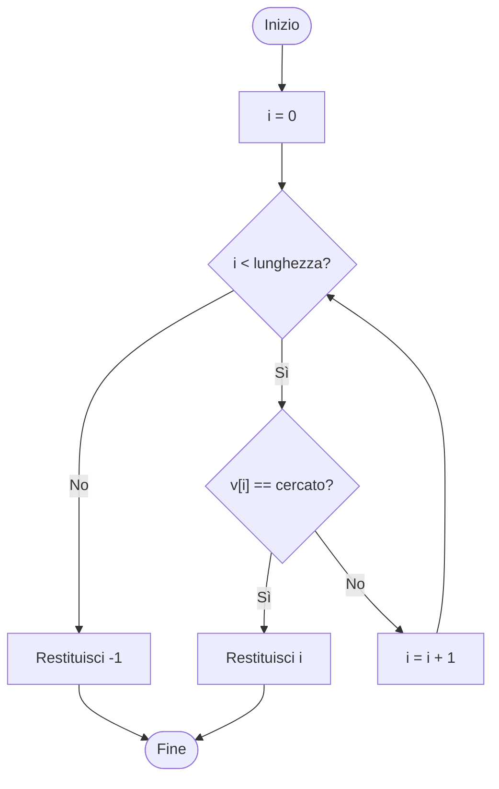

# Ricerca sequenziale in un array

La ricerca sequenziale controlla gli elementi di un array uno dopo l'altro, a partire dal primo. Si ferma quando trova il valore cercato e restituisce il suo indice.

## Implementazione

```java
public static int cerca(int[] v, int cercato) {
    for (int i = 0; i < v.length; i++) {
        if (v[i] == cercato) {
            return i;
        }
    }
    return -1;
}
```

Con l'array di voti `{7, 6, 8, 5, 9}` e il valore cercato `8` il metodo restituisce `2`.

## Diagramma di flusso



## Elemento non presente

Se il valore cercato non compare nell'array, la seconda decisione non è mai vera. L'indice `i` cresce fino a raggiungere la lunghezza dell'array, la prima decisione diventa falsa e il metodo restituisce `-1`. Il valore `-1` non è un indice valido, quindi chi chiama il metodo può riconoscere che la ricerca è fallita.
