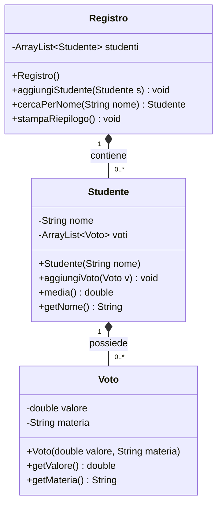
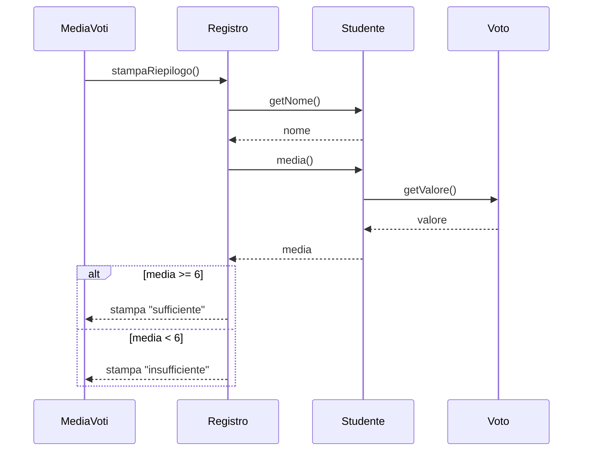

# Architettura di MediaVoti

Il programma `MediaVoti` legge un file CSV e stampa la media di ogni studente. Usa quattro classi: `Voto`, `Studente` e `Registro` modellano i dati, mentre `MediaVoti` contiene il metodo `main`. Nessuna classe usa l'ereditarietà.

## Diagramma delle classi

Il segno `-` indica un attributo privato e il segno `+` un membro pubblico. Un `Registro` contiene zero o più `Studente` e ogni `Studente` possiede zero o più `Voto`. Il rombo pieno indica la composizione: se un registro sparisce, spariscono anche i suoi studenti e i loro voti. La classe `MediaVoti` non compare perché contiene solo `main` e non ha attributi.

## Diagramma di sequenza

Il diagramma mostra la stampa del riepilogo. `Registro` chiede a ogni `Studente` il nome e la media. Per calcolare la media, `Studente` legge il valore di ciascun `Voto`. Il blocco `alt` distingue i due esiti: con media almeno 6 il riepilogo riporta «sufficiente», altrimenti «insufficiente». Il diagramma mostra un solo studente: il ciclo su tutti gli studenti non è disegnato.
