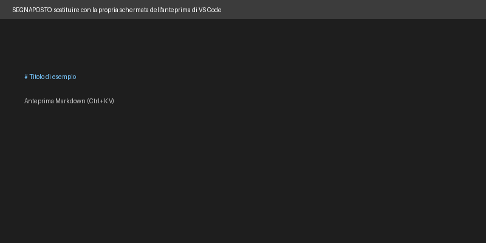

# Risorse del corso

Questa pagina raccoglie i collegamenti che uso più spesso durante il modulo su Markdown e documentazione.

## Collegamenti esterni

- [Sito ufficiale di Markdown](https://daringfireball.net/projects/markdown/): la descrizione originale della sintassi.
- [Specifica CommonMark](https://spec.commonmark.org/): la definizione precisa delle regole di scrittura.
- [Manuale di Pandoc](https://pandoc.org/MANUAL.html): le opzioni per convertire i documenti in altri formati.

## Collegamenti interni

- [README del repository](../README.md): la pagina di presentazione del mio repository.

## Immagine

