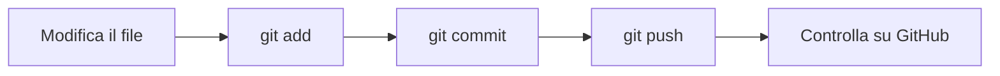

# Laboratorio di Informatica 4Bi: Fabian Skala
Questo repository raccoglie gli esercizi del corso di laboratorio di informatica. Ogni modulo ha la sua cartella. Gli esercizi sono consegnati con commit distinti.

## Moduli

| Modulo | Cartella | Stato |
| :----- | :------- | :---- |
| M0 | `M0_ambiente` | completato |
| M1 | `M1_markdown/`, `M1_jupyter/` | in corso |

## Clonare il repository

1. Clona il repository:

   ```bash
   git clone https://github.com/Fabian.skala/repository.git
   cd repository
   ```

2. Apri la cartella in Visual Studio Code:

   ```bash
   code .
   ```

3. Apri l'anteprima dei file Markdown con `Ctrl+K` seguito da `V`.
4. Apri i notebook dal Jupyter server d'istituto: accedi, carica i file `.ipynb` di `M1_jupyter/` nella tua cartella personale e aprili con il kernel Python 3.

## Convenzioni

- Nomina le cartelle con il codice del modulo e un nome breve, per esempio `M1_markdown`.
- Scrivi i messaggi di commit al presente indicativo, con una prima riga di massimo cinquanta caratteri, senza punto finale, e il numero dell'esercizio fra parentesi.
- Non versionare i file `.html` e `.pdf` generati e la cartella `.ipynb_checkpoints/`.
- Salva i notebook con gli output nel primo commit e ripulisci gli output con `jupyter nbconvert --clear-output --inplace` nel commit successivo.

## Flusso di consegna



## Autore e licenza

Autore: Fabian Skala, classe 4Bi, ITT "G. Marconi" di Rovereto.
Contatto: fabian.skala@marconirovereto.it.
Licenza: MIT.
